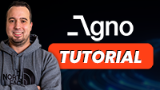

<h1>Agno (formerly Phidata) Tutorial</h1>

<h2>Watch the full tutorial on my YouTube Channel</h2>
<div>

<a href="https://www.youtube.com/watch?v=T3CKcwVTYlM">
    
</a>
</div>

<h2>Prerequisites</h2>
<ul>
  <li>Python 3.11+</li>
</ul>

<h2>Installation</h2>
<h3>1. Clone the repository:</h3>

```
git clone https://github.com/ThomasJanssen-tech/Agno-Tutorial
cd Agno-Tutorial
```

<h3>2. Create a virtual environment</h3>

```
python -m venv venv
```

<h3>3. Activate the virtual environment</h3>

```
venv\Scripts\Activate
(or on Mac): source venv/bin/activate
```

<h3>4. Install libraries</h3>

```
pip install -r requirements.txt
```

<h3>5. Add your OpenAI API Key</h3>
<ul>
<li>Aadd an OpenAI API key</li>
</ul>

<h2>Executing the scripts</h2>

- Open a terminal in VS Code

- Execute the following command:

```
python run finance-agent.py
python run agentic-rag.py
python run multi-agent.py
```

<h2>Further reading</h2>
<ul>
<li>https://docs.agno.com/introduction</li>
</ul>
